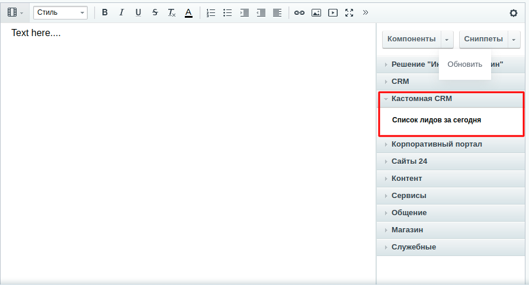

## Bitrix API D7 (работа с CRM и модулем IBlock)

#### Требования
Корпоративный портал версии не ниже 20.0 с установленными модуля crm и iblock

#### Установка
- Копируем компонент в папку `local`
```
    $ cp local/components/custom DocumentRoot/local/components
```
`DocumentRoot` - корневая папка сайта

- После создаем страницу в визульном редакторе Битрикс и переносим на нее компонент из сайдбара. Если компонент не появился, то обновляем кеш компонентов.

- Настраиваем параметры компонента, сохраняем страницу.
- Смотрим результат.

#### Дополнительные требования
- Для выбранного инфоблока в настройках компонента необходимо задать в его настройках символьный код API, иначе элементы инфоблока выбираться не будут.
- Необходимо для основных сущностей создать ORM. Это можно выполнить на странице `http://crm.dev/bitrix/admin/perfmon_tables.php?lang=ru`, добавив в адресную строку параметр `orm=y`. После этого в таблицах появится пункт `ORM`. Основные таблицы, для которых используется `ORM`:
```
b_iblock
b_iblock_element
b_iblock_property
b_crm_lead
```

